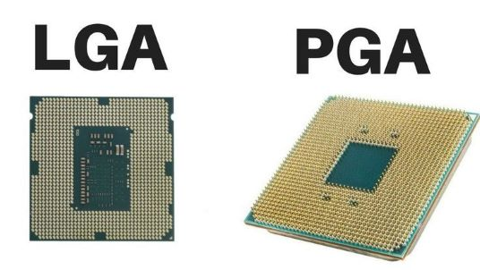

# Tipos de encapsulado: PGA, LGA y BGA

---

| Tipo  | Cómo identificarlo |
|-------|--------------------|
| **PGA** (Pin Grid Array) | El CPU tiene pines |
| **LGA** (Land Grid Array) | La placa madre tiene pines |
| **BGA** (Ball Grid Array) | El chip está soldado directamente a la placa (no extraíble) |

---

| Tipo  | Ejemplos reales |
|-------|-----------------|
| **PGA**   | AMD Athlon, FX; AMD Ryzen 1000–5000 (AM4); Microcontroladores AVR y PIC antiguos |
| **LGA**   | Intel LGA 1151, 1200, 1700; Intel Xeon; AMD Ryzen 7000 (AM5) |
| **BGA**   | GPUs Nvidia y AMD; Snapdragon, Apple A-series; Consolas PS5 y Xbox Series X; Chipsets y RAM LPDDR |

---

| Comparativa               | PGA (Pin Grid Array)                        | LGA (Land Grid Array)                                | BGA (Ball Grid Array)                                 |
|-----------------------|---------------------------------------------|-------------------------------------------------------|--------------------------------------------------------|
| **¿Dónde están los pines?** | En el **CPU**                              | En el **socket**                                      | No hay pines: **bolas de soldadura** bajo el chip     |
| **Tipo de contacto**      | Pines → agujeros                             | Pads planos → pines del socket                       | Bolas → PCB                                            |
| **Desmontable**           | Sí                                           | Sí                                                    | No (soldado)                                           |
| **Reemplazo por usuario** | Fácil                                        | Moderado                                              | Imposible sin reballing                                |
| Densidad de pines     | Media                                        | Alta                                                  | Muy alta                                               |
| Resistencia mecánica  | Baja (pines se doblan)                       | Media (socket delicado)                              | Muy alta (va soldado)                                  |
| Estabilidad térmica   | Buena                                        | Muy buena                                             | Excelente                                               |
| Frecuencias soportadas| Media                                        | Alta                                                  | Muy alta                                               |
| Coste fabricación     | Bajo                                         | Medio                                                 | Alto                                                    |
| **Riesgo principal**      | Pines del CPU doblados                       | Pines del socket dañados                              | “Cold joints” / soldadura agrietada                    |
| **Instalación**          | Fácil (poca presión)                         | Requiere presión + mecanismo metálico                 | No aplicable                                           |
| Reballing posible     | No                                           | No                                                    | Sí (solo laboratorio)                                  |
| Aplicación típica     | CPUs AMD antiguas y AM4, MCUs                | CPUs Intel modernas, AMD AM5, servidores              | GPUs, SoCs móviles, consolas, chipsets, RAM BGA        |
| Ejemplos reales       | AMD Ryzen 1000–5000 (AM4), Athlon 64         | Intel i3–i9 (LGA 1151–1700), Ryzen 7000 (AM5)         | Snapdragon, Apple A-series, GPUs Nvidia/AMD, PS5/Xbox  |

---

## Resumen 
>- **PGA** → Pines en el CPU, socket con agujeros, fácil de cambiar, pines frágiles.
>- **LGA** → Pines en el socket, CPU robusto, alta densidad, socket delicado.
>- **BGA** → Sin socket, soldado, rendimiento máximo, no reemplazable.

