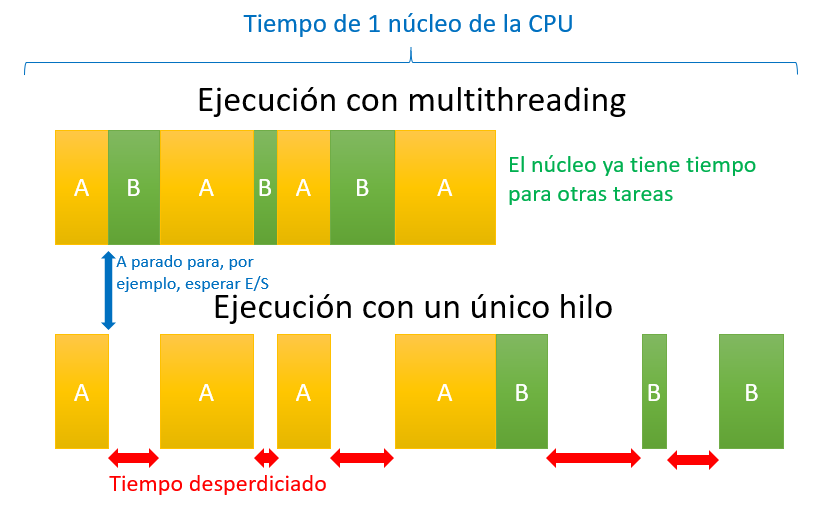

# 1. Nomenclatura de procesadores Intel
> **Objetivo:** aprender a **seleccionar y justificar procesadores según necesidades reales**.

La nomenclatura de Intel permite conocer **las características del procesador** a partir de su nombre comercial.

**Ejemplo:** Intel Core i7-12700K  

### Partes del nombre
| Parte | Ejemplo | Significado |
|-------|---------|-------------|
| **Marca** | Intel | Fabricante |
| **Familia** | Core | Línea del procesador |
| **Nivel** | i3 / i5 / i7 / i9 | Gama (baja / media / alta / entusiasta) |
| **Generación** | **12**700K → *12ª gen* | Cada año aprox. cambia |
| **SKU** | **700** | Indica la posición en la gama dentro de la generación |
| **Sufijo** | **K** | Característica avanzada |

### Sufijos Intel
| Sufijo | Significado |
|--------|-------------|
| K | Overclock permitido (alto rendimiento) |
| KF | K + sin GPU integrada |
| F | Sin GPU integrada |
| T | Bajo consumo |
| H | Alto rendimiento para portátiles (High Performance) |
| P | Sin gráficos de bajo consumo |
| U | Ultra bajo consumo (portátiles) |
| G | Con gráfica dedicada Radeon integrada (laptops) |

---

## Tabla rápida para interpretar procesadores Intel
| Ejemplo | Gama | Generación | GPU | Particularidad |
|---------|------|------------|-----|----------------|
| i3-10100 | Baja | 10ª | Sí | Entrada |
| i5-12400F | Media | 12ª | No | Sin iGPU |
| i7-12700K | Alta | 12ª | Sí | OC permitido |
| i9-13900KF | Entusiasta | 13ª | No | OC + sin iGPU |
| i7-11800H | Alta | 11ª | Sí | Alto rendimiento portátil |

---

### **3.1. Interpreta los siguientes procesadores:**

| Procesador | Generación | Gama | ¿Tiene GPU integrada? | ¿Permite overclock? | Tipo de equipo apropiado |
|------------|------------|------|------------------------|---------------------|---------------------------|
| Intel Core i5-11400 | | | | | |
| Intel Core i7-10700K | | | | | |
| Intel Core i9-13900KF | | | | | |
| Intel Core i5-1240P | | | | | |
| Intel Core i3-10100F | | | | | |

### **3.2. Cuestiones**
1. ¿Qué indica la cifra inicial después del guion (ej: 12700 → 12)?
2. ¿Qué significa el sufijo **F**?
3. ¿Qué diferencia hay entre **K** y **KF**?
4. ¿Qué tipo de procesador es mejor para un portátil de gran autonomía: H, U o K? ¿Por qué?
5. Un ordenador de juegos sin gráfica dedicada ¿debería evitar los procesadores con sufijo **F**? Explica.

### **3.3. Reto**
Busca dos procesadores Intel reales en una tienda online y explica si encajarían mejor en:
- Equipo de oficina
- Equipo gaming
- Estación de trabajo profesional
- Portátil ultraligero

---

# 2. Núcleos P y E de Intel  

| Tipo de Procesador | Significado | Características | Aplicaciones típicas |
|-------------------|-------------|----------------------------|----------------------|
| **P-Cores** (Performance) | Núcleos de **Rendimiento** | • Núcleos grandes físicamente • Mayor velocidad de reloj • Mayor consumo energético • Soporta Hyper-Threading (2 hilos/núcleo) • Caché L2 independiente por núcleo | • Videojuegos • Aplicaciones CAD • Edición profesional (foto/vídeo) • Tareas de alta exigencia computacional |
| **E-Cores** (Efficiency) | Núcleos de **Eficiencia** | • Núcleos más pequeños • Menor velocidad de reloj • Consumo energético reducido • Sin Hyper-Threading • Agrupados en módulos de 4 núcleos • Caché L2 compartida por módulo | • Navegación web • Contenido multimedia • Aplicaciones de ofimática • Tareas en segundo plano • Soporte en streaming y codificación |  

---

