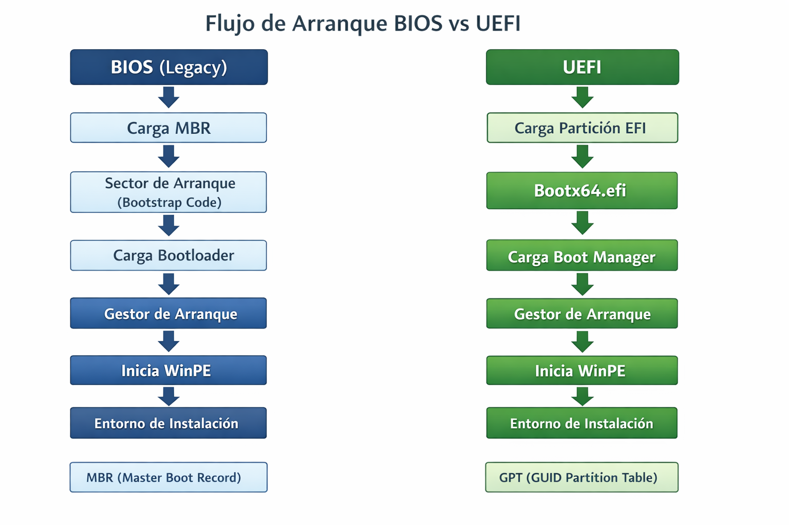

  
---

## 1. ¿Qué es la BIOS?
 
La **BIOS (Basic Input/Output System)** es el sistema básico de entrada/salida almacenado en memoria ROM/Flash en la placa base. Es el primer programa *(firmware)* que se ejecuta al encender el equipo y sus funciones principales son:  
- Inicializar el hardware
- Ejecutar el POST
- Configuración del sistema
- Cargar el sistema operativo en memoria
 
La versión moderna de la BIOS es la **UEFI (Unified Extensible Firmware Interface).**

## 2. BIOS vs UEFI   

| Característica | BIOS (Legacy) | UEFI |
|----------------|------|------|
| Interfaz | Texto | Gráfica |
| Arquitectura | 16 bits | 32/64 bits |
| Tabla particiones | MBR (2TB máx) | GPT (9.4 ZB) |
| Secure Boot | No | Sí |
| Drivers propios | No | Sí |
| Velocidad | Más lenta | Más rápida |  

## 3. Fases de arranque (POST)  

### 1️⃣ POST (Power-On Self Test)
- Verificación CPU
- Comprobación RAM
- Inicialización chipset
- Detección dispositivos de almacenamiento (SATA/NVMe)
- Detección GPU
- Señales acústicas (beep codes)

### 2️⃣ Inicialización Hardware
- Controladores básicos integrados
- Inicialización buses PCIe
- Enumeración dispositivos

### 3️⃣ Boot Manager
- Selección dispositivo de arranque
- Carga MBR (BIOS) o EFI Bootloader (UEFI)  

## 4. Configuración 

-   Boot Order
-   Modo SATA (AHCI/IDE/RAID)
-   Virtualización (Intel VT-x / AMD SVM)
-   Fecha y Hora
-   Secure Boot
-   Fast Boot
-   Overclocking básico

## 5. Flujo de arranque BIOS vs UEFI

  

### 5.1. Flujo de arranque en BIOS (Legacy)

El sistema BIOS (Basic Input/Output System) es el firmware tradicional presente en equipos más antiguos.

#### Secuencia del proceso

1. Encendido del equipo.
2. La BIOS realiza el POST (Power-On Self Test) para comprobar hardware.
3. La BIOS busca un dispositivo de arranque según el orden configurado.
4. Lee el primer sector del disco (sector 0).
5. Carga el MBR (Master Boot Record).
6. El MBR ejecuta el código de arranque (bootstrap code).
7. Se carga el bootloader del sistema operativo.
8. El gestor de arranque inicia Windows.
9. Se carga el entorno WinPE o el sistema instalado.

#### Comentario técnico

En BIOS, el proceso depende del MBR, que solo dispone de 512 bytes para el código inicial de arranque. Esto limita la flexibilidad del sistema.  
El firmware no entiende sistemas de archivos complejos; simplemente ejecuta el código contenido en el primer sector del disco.

Limitaciones principales:

- Máximo 2 TB por disco.
- Solo 4 particiones primarias.
- Código de arranque muy limitado.
- Menor seguridad frente a modificaciones del sector de arranque.

Es un sistema funcional pero obsoleto en hardware moderno.

---

### 5.2. Flujo de arranque en UEFI

UEFI (Unified Extensible Firmware Interface) es el firmware moderno que sustituye a la BIOS tradicional.

#### Secuencia del proceso

1. Encendido del equipo.
2. UEFI realiza comprobación de hardware.
3. Lee la tabla GPT del disco.
4. Busca la partición EFI.
5. Carga el archivo bootx64.efi.
6. Ejecuta el Windows Boot Manager.
7. Se inicia WinPE o el sistema operativo.

#### Comentario técnico

A diferencia de BIOS, UEFI no ejecuta código desde el primer sector del disco.  
En su lugar, accede a una partición especial llamada EFI, que contiene archivos ejecutables .efi.

Ventajas principales:

- Soporta discos mayores de 2 TB.
- Permite muchas particiones.
- Arranque más rápido.
- Soporte de Secure Boot (protección contra malware en arranque).
- Arquitectura modular y más flexible.

UEFI funciona como un mini sistema operativo previo al sistema operativo principal.

---

### 5.3. Comparación técnica

| Característica | BIOS (Legacy) | UEFI |
|---------------|---------------|-------|
| Tipo de tabla | MBR | GPT |
| Tamaño máximo disco | 2 TB | > 2 TB |
| Número particiones | 4 primarias | Hasta 128 |
| Seguridad | Baja | Alta (Secure Boot) |
| Velocidad de arranque | Más lenta | Más rápida |
| Flexibilidad | Limitada | Alta |

---

### 5.4. Conclusión

El arranque BIOS depende de código almacenado en el MBR y está limitado por su diseño histórico.

El arranque UEFI utiliza una estructura moderna basada en particiones GPT y archivos ejecutables EFI, ofreciendo mayor seguridad, escalabilidad y rendimiento.

En entornos actuales, UEFI es el estándar recomendado.

## 6. Errores típicos BIOS
- Boot loop (pitidos continuos) → RAM mal instalada
- No detecta disco → Modo SATA incorrecto
- Error Secure Boot → SO incompatible
- No arranca USB → Orden de arranque mal configurado  

## 7. Simulador de BIOS/UEFI online  

[Simulador BIOS/UEFI online](https://download.lenovo.com/bsco/index.html)   

## 8. Síntesis
>- La BIOS/UEFI es el firmware que prepara el equipo antes de que cargue el sistema operativo.
>- La UEFI es un mini-sistema operativo previo al sistema operativo principal.

## 9. Autoevaluación  

[Test de autoevaluación BIOS](https://github.com/ezellabor/Montaje-y-Mantenimiento-de-Equipos-MME-SMR1/blob/main/Tests%20y%20Autoevaluaci%C3%B3n/bios-basico-test.md)

