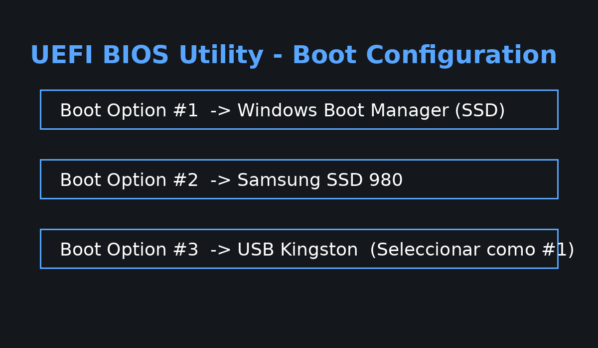
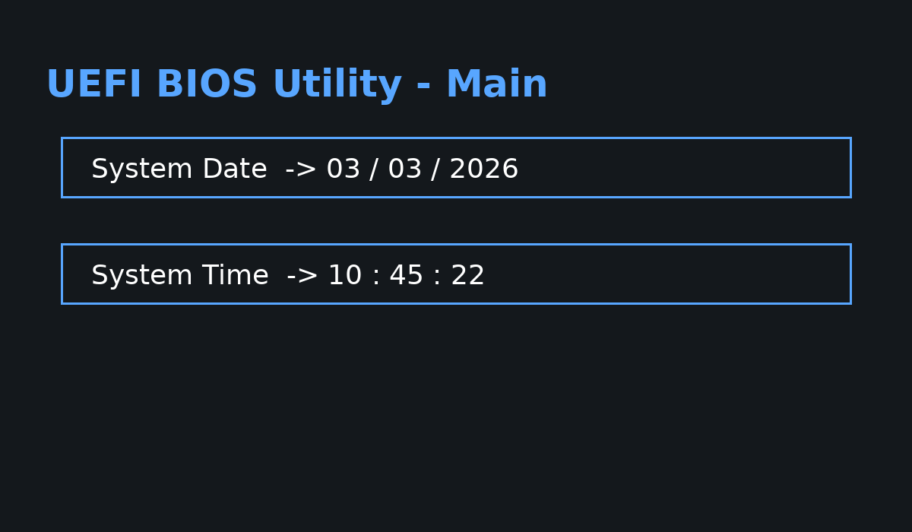
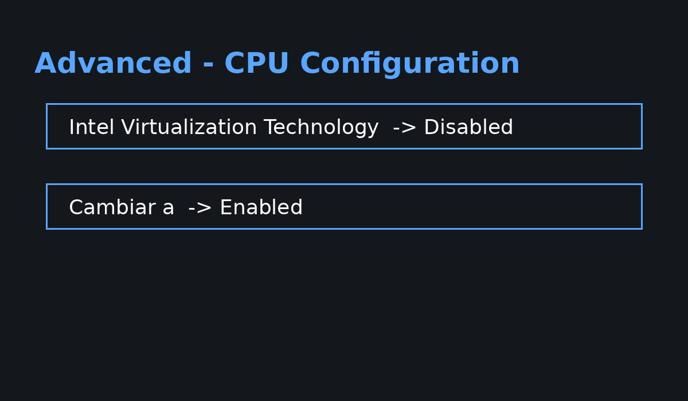
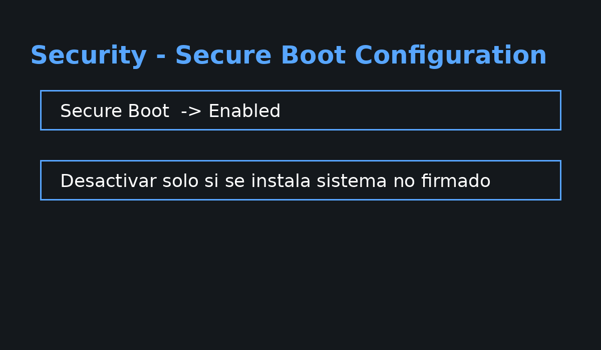

# Práctica: Configuración de BIOS / UEFI  

---

## 1. Objetivos  

El alumno será capaz de:

- Identificar el tipo de firmware de una placa base.
- Acceder a BIOS/UEFI.
- Modificar el orden de arranque.
- Configurar fecha y hora del sistema.
- Activar virtualización por hardware.
- Comprender el impacto técnico de cada configuración.

---

## 2. Placas base a configurar

1. ASUS Prime B760-Plus  
2. Gigabyte B550M DS3H  
3. MSI PRO H610M-B  
4. ASRock B450M-HDV  
5. Intel Desktop Board DH61WW  

---

## 3. Identificación del Firmware

Todas las placas modernas utilizan **UEFI (basado en AMI)** excepto modelos antiguos que pueden incluir modo Legacy/CSM*.

Características comunes:

- Soporte GPT
- Secure Boot
- Virtualización (Intel VT-x o AMD SVM)
- Interfaz gráfica

<details>
<summary>CSM (Compatibility Support Module)</summary>  
  
 
 _CSM es un componente del firmware UEFI en placas base modernas que permite arrancar sistemas operativos antiguos o discos con particiones MBR, emulando el comportamiento de una BIOS tradicional (Legacy). Es necesario activar CSM para usar hardware viejo o sistemas operativos anteriores a Windows 10 en equipos nuevos._  

</details>
  
---

## 4. Parámetro 1: Cambio de orden de arranque

### Objetivo
Arrancar desde USB o segundo disco.

### Ruta típica

```
Boot → Boot Option Priorities
```

---

### Captura simulada UEFI

  


### Acción esperada:
Cambiar Boot Option #1 a USB.

---

## 5. Parámetro 2: Fecha y Hora

### Ruta típica

```
Main → System Date / System Time
```

---

### Captura simulada Fecha/Hora




### Explicación técnica

- La fecha se almacena en el RTC.
- Si la pila CMOS se agota → se pierde la configuración.
- Puede afectar certificados, dominio, actualizaciones.

---

## 6. Parámetro 3: Activar virtualización

### Ruta Intel

```
Advanced → CPU Configuration → Intel VT-x
```

### Ruta AMD

```
Advanced → SVM Mode
```

---

### Captura simulada Virtualización





### Impacto técnico

Si está desactivado:
- VirtualBox mostrará error VT-x disabled
- No se podrá usar virtualización por hardware

---

## 7. Parámetro adicional: Secure Boot

### Ruta

```
Boot → Secure Boot
```

---

### Captura simulada Secure Boot




---

## 8. Procedimiento general

1. Reiniciar equipo.
2. Pulsar DEL o F2.
3. Entrar en modo Advanced.
4. Modificar parámetro.
5. Guardar con F10.
6. Confirmar reinicio.

---

## 9. Errores típicos

- No guardar cambios.
- Activar Legacy sin convertir disco a MBR.
- Desactivar Secure Boot sin necesidad.
- Confundir SVM con SMT.

---

## 10. Síntesis 

UEFI reemplaza al BIOS tradicional ofreciendo:

- Mayor seguridad
- Soporte GPT
- Arranque más rápido
- Soporte virtualización avanzada
- Interfaz gráfica moderna

La correcta configuración del firmware es esencial en:

- Instalaciones de sistema operativo
- Recuperación técnica
- Virtualización
- Seguridad del arranque

---

## 11. Herramientas online para simular BIOS

### Opción 1: Simulador de UEFI dentro de VirtualBox

Características:

- Crear máquina virtual en VirtualBox
- Activar opción "Enable EFI"
- Acceder al entorno UEFI virtual

Es lo más realista sin tocar hardware.


### Opción 2: Simulador interactivo de BIOS (educativo)

https://www.biosflash.com/e/bios-simulator.htm

- Simulador básico tipo Award BIOS.
- Muy útil para práctica conceptual.

### Opción 3: Documentación interactiva fabricantes

Muchos fabricantes permiten navegar por manuales UEFI:

- ASUS
- MSI
- Gigabyte Technology

Pueden descargar manual PDF y simular recorrido de menús.

### Opción 4: Simulación en Tinkercad  

Solo conceptual porque no tiene BIOS real, pero permite explicar arranque conceptual.


## 12. Entregable
Debe incluir:

- Identificación de firmware de cada placa.
- Ruta exacta de cada parámetro.
- Explicación técnica.
- Capturas reales o esquemas.
- Conclusión final.

---

## 13. Criterios de evaluación

| Criterio | Puntos |
|----------|--------|
| Identificación correcta | 4 |
| Cambio orden arranque | 4 |
| Fecha y hora | 3 |
| Virtualización | 4 |
| Explicación técnica | 3 |
| Presentación | 2 |

---


