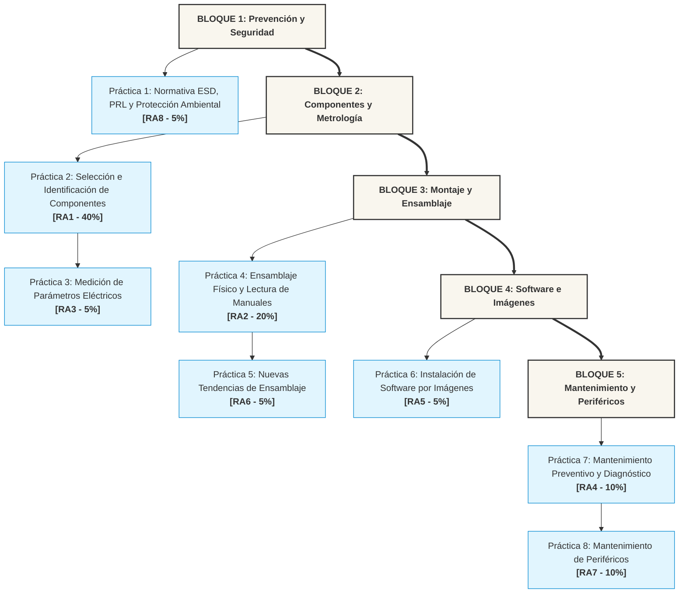

## Secuencia cronológica de prácticas  
---  

```mermaid
graph TD
    %% Estilos de nodos
    classDef bloque fill:#f9f6ee,stroke:#333,stroke-width:2px,font-weight:bold;
    classDef practica fill:#e1f5fe,stroke:#0288d1,stroke-width:1px;

    %% Nivel Principal: Bloques Secuenciales
    B1["BLOQUE 1: Prevención y Seguridad"]:::bloque
    B2["BLOQUE 2: Componentes y Metrología"]:::bloque
    B3["BLOQUE 3: Montaje y Ensamblaje"]:::bloque
    B4["BLOQUE 4: Software e Imágenes"]:::bloque
    B5["BLOQUE 5: Mantenimiento y Periféricos"]:::bloque

    %% Prácticas del Bloque 1
    P1["Práctica 1: Normativa ESD, PRL y Protección Ambiental<br><b>[RA8 - 5%]</b>"]:::practica
    B1 --> P1

    %% Prácticas del Bloque 2
    P2["Práctica 2: Selección e Identificación de Componentes<br><b>[RA1 - 40%]</b>"]:::practica
    P3["Práctica 3: Medición de Parámetros Eléctricos<br><b>[RA3 - 5%]</b>"]:::practica
    B2 --> P2
    P2 --> P3

    %% Prácticas del Bloque 3
    P4["Práctica 4: Ensamblaje Físico y Lectura de Manuales<br><b>[RA2 - 20%]</b>"]:::practica
    P5["Práctica 5: Nuevas Tendencias de Ensamblaje<br><b>[RA6 - 5%]</b>"]:::practica
    B3 --> P4
    P4 --> P5

    %% Prácticas del Bloque 4
    P6["Práctica 6: Instalación de Software por Imágenes<br><b>[RA5 - 5%]</b>"]:::practica
    B4 --> P6

    %% Prácticas del Bloque 5
    P7["Práctica 7: Mantenimiento Preventivo y Diagnóstico<br><b>[RA4 - 10%]</b>"]:::practica
    P8["Práctica 8: Mantenimiento de Periféricos<br><b>[RA7 - 10%]</b>"]:::practica
    B5 --> P7
    P7 --> P8

    %% Conexiones secuenciales entre bloques
    B1 ==> B2
    B2 ==> B3
    B3 ==> B4
    B4 ==> B5
```
