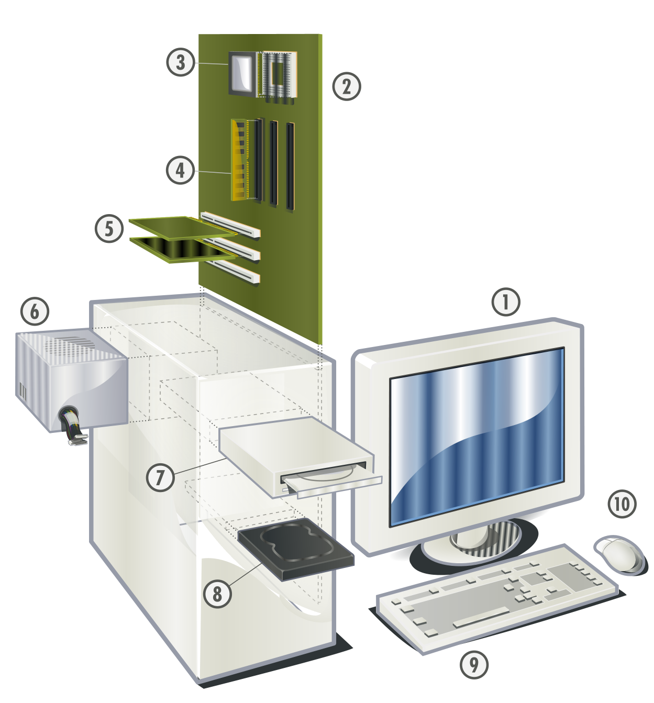
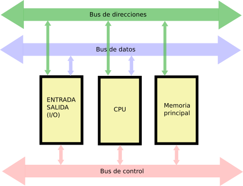

# SMR1 | Montaje y Mantenimiento de Equipos 

  

### Componentes principales de un equipo informático

[https://github.com/ezellabor/Montaje-y-Mantenimiento-de-Equipos-MME-SMR1/blob/main/Fichas-Guias-Tablas-Resumen/componentes-pc.html]  

>Profesor: Ezequiel Llarena Borges
>ezequiel.formacion@gmail.com
---

