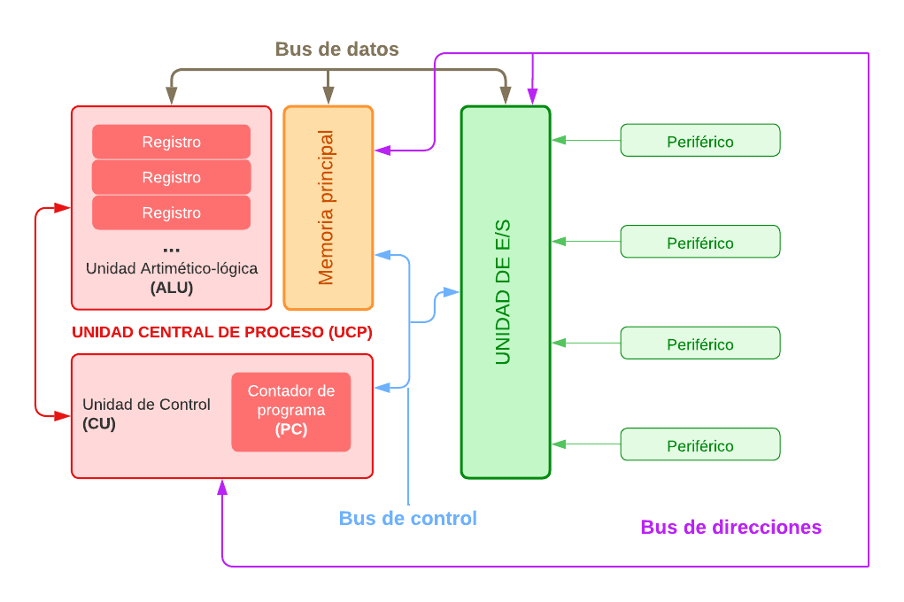
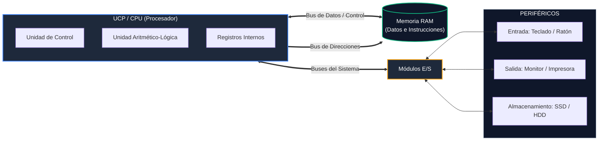
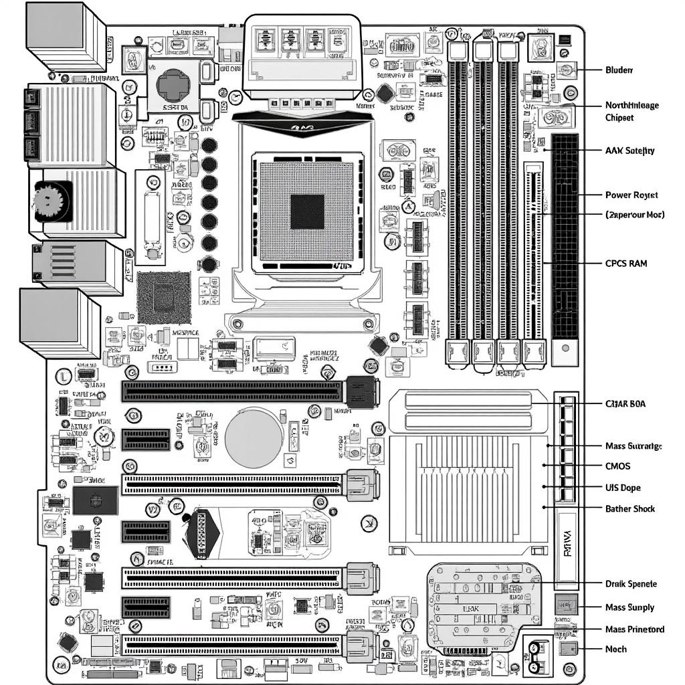

# SMR1 | Montaje y Mantenimiento de Equipos 

  

### Componentes principales de un equipo informático

* [Esquema de elementos de Hardware y Buses de Comunicación de un Sistema Informático (Mapa interactivo)](https://github.com/ezellabor/Montaje-y-Mantenimiento-de-Equipos-MME-SMR1/blob/main/Fichas-Guias-Tablas-Resumen/esquema-componentes-hw-interactivo.html)
* [Guía Resumen de Arquitectura y Componentes de un Sistema Microinformático](https://github.com/ezellabor/Montaje-y-Mantenimiento-de-Equipos-MME-SMR1/blob/main/Fichas-Guias-Tablas-Resumen/sintesis-mme-smr1.html)

--- 
### Arquitectura Von-Neumann  

  

### Esquema de Buses  

### Esquema de placa base (Motherboard)  

>Profesor: Ezequiel Llarena Borges
>elb733@educa.madrid.org
---

